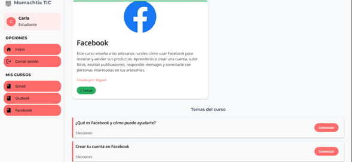
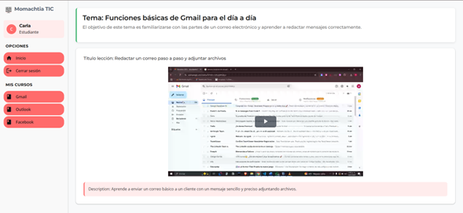
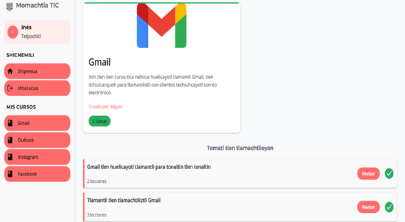

# Course Platform
This is the frontend of a platform designed to manage and deliver online courses. The system allows students to enroll in courses, track their progress, and access course content, while instructors can efficiently create, update, and manage their courses.

The platform supports Spanish and Nahuatl, making learning accessible to the target test group and ensuring inclusivity for users from diverse linguistic backgrounds.

## Table of Contents
* [General Info](#general-information)
* [Technologies Used](#technologies-used)
* [Features](#features)
* [Screenshots](#screenshots)
* [Project Status](#project-status)
* [Acknowledgements](#acknowledgements)

## General Information
This project is focused on bridging the digital divide by providing a web-based educational platform with multimedia resources tailored specifically for rural artisans. Many rural communities lack adequate internet infrastructure, and artisans in these areas often have limited access to formal technology education and resources for independent learning.

As a result, these artisans face challenges not only in personal skill development but also in sharing and selling their products beyond local markets. This platform aims to empower them by offering basic technology training, enabling them to make better use of Information and Communication Technologies (ICT) to promote and commercialize their crafts.

By doing so, the project contributes to the cultural and social development of the region, while also creating a positive economic impact for the artisans and their communities.

## Technologies Used
This project is built with the following technologies:

- **React 19** – Main library for building the user interface.  
- **React Router DOM** – Client-side routing for navigation between pages.  
- **React Icons 5.5** – Collection of icons for UI components.  
- **React PDF 9.2** – Display PDF files within the application.    
- **i18next & react-i18next** – Internationalization and localization support.  
- **Vite** – Fast frontend build tool and development server.
- **Axios 1.8** – HTTP client for API requests.  
- **Video.js 8.22** – Video player library for advanced media playback.  

## Features
- Student registration and course enrollment
- Progress tracking for courses and lessons
- Content management (videos, documents, quizzes)
- Instructor dashboard to create, update, and manage courses
- Support for multiple languages (Spanish and Nahuatl)
- Role-based access control for students and instructors

## Screenshots
**Login Page**  

**Lesson Video Page**  

**Course Page with Translation**  

## Project Status
✅ Core backend features fully implemented
✅ Student and instructor authentication completed
✅ Course management and enrollment fully functional
✅ Platform tested with the target group (rural artisans)
⚠️ Project is no longer actively maintained

## Acknowledgements
This project was inspired and guided by my teacher and advisor, Maria Eugenia (Maru). Her support and mentorship were invaluable in shaping the platform and ensuring it met the needs of the target group.
